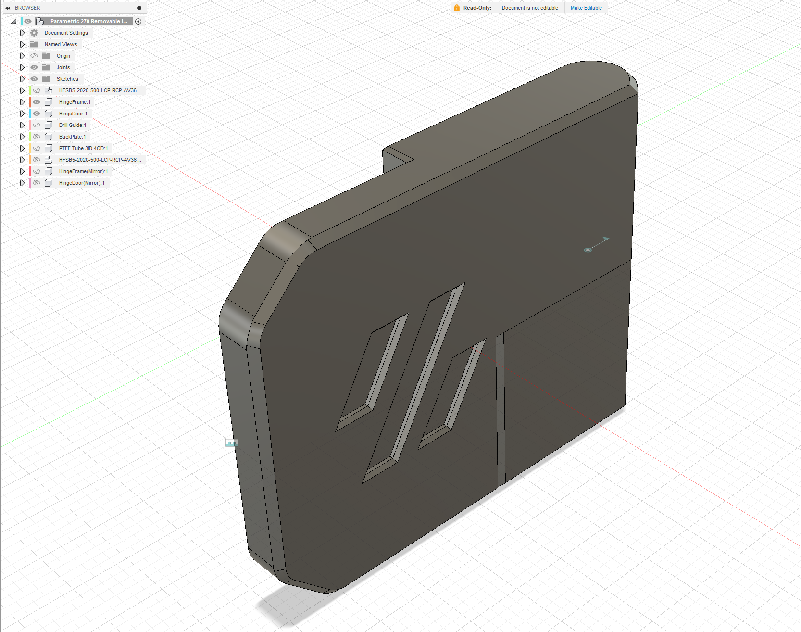
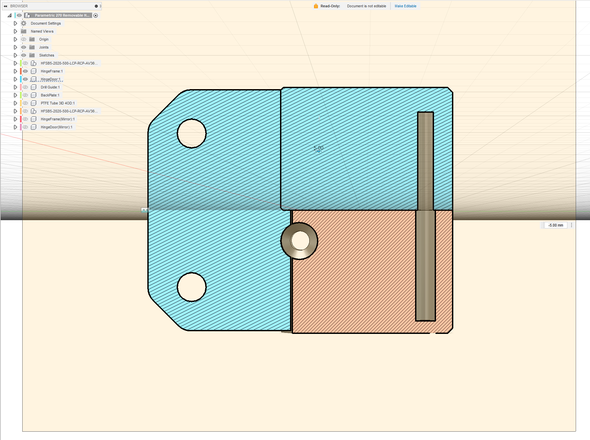
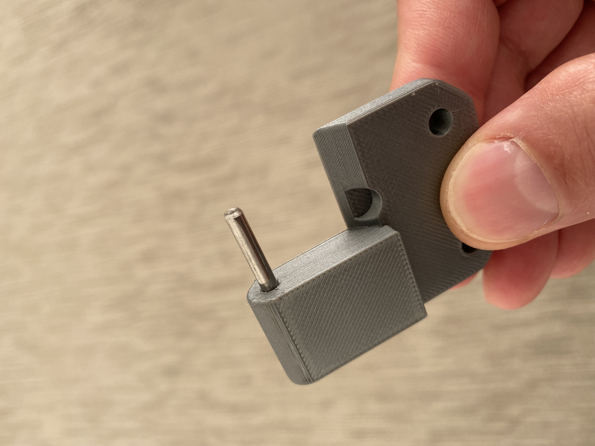
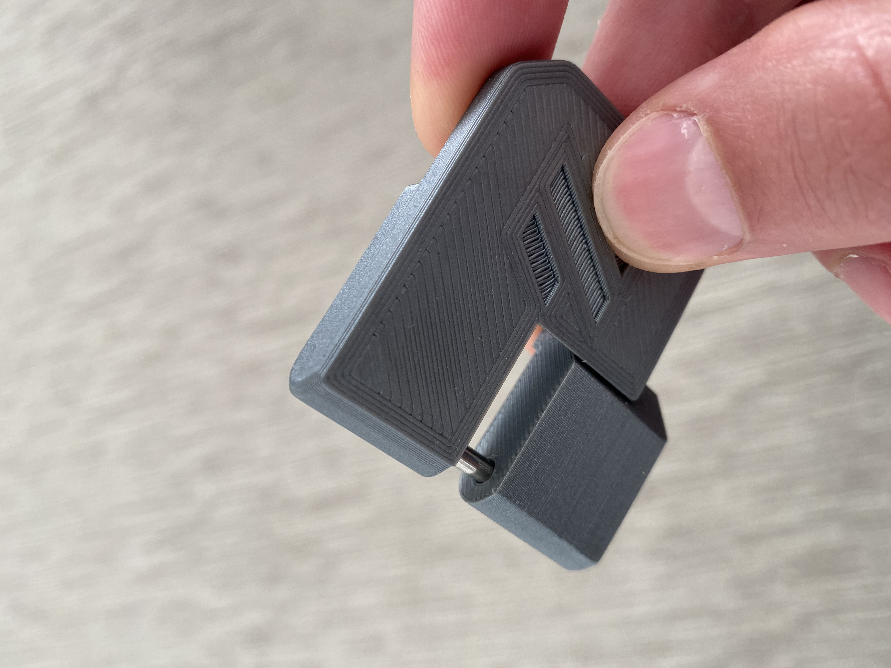

# 270 Degree Removalble Hinges
This is a modification of Logan Fraser's great design for [270 Degree Removable Hindges]
(https://github.com/LoganFraser/VoronMods/tree/main/ParametricRemovable270Hinges).

The original design calls for using M3x30 or M3x35 SHCS for the hinge pin that slides into
a section of PTFE tubing. Since metric bolts are not as easy to find in the US as other
places, I didn't want to use whatever little hardware I had for that. On the other hand,
steal rods are very easy to find.

So, I modified the design to use a 3mm steal rod instead of M3 SHCS.

## BOM

Most of the items in the original BOM are still required with the exception of the
M3x30/M3x35 SHCS and the 3mm ID, 4mm OD PTFE tubing. The items listed below are per
hinge:

* 1 x 3mmx32mm steal rod. I used this [3mm x 150mm 304 steal rod](https://www.amazon.com/uxcell-150mm-Stainless-Steel-Solid/dp/B082ZP4H3N?ref_=ast_sto_dp&th=1) and cut it into 32mm sections. 
* 1 x 3mm or 1/8" drill bit for drilling the panels.
* 1 x m3-8mm socket head cap screw for hinge frame
* 1 x m3 roll-in nut for hinge frame
* 2 x m3 5x4x3mm heat set insert (voron standard)
* 2 x M3-10mm or 12mm (depending on panel thickness). Can use flat head if you have them or flip the back plates over and use pan or socket heads.

## Assembly

The assembly is pretty streight forward:

1. Insert the 32mm section of steal rod into the upper part of the door hinge. This should be a pretty tight friction fit. You may have to use a hammer or mallet to gently tap it in place. 
2. Insert the upper part into the matching lower part. 
3. The instructions for the rest of the assembly follows the ones on the original page.