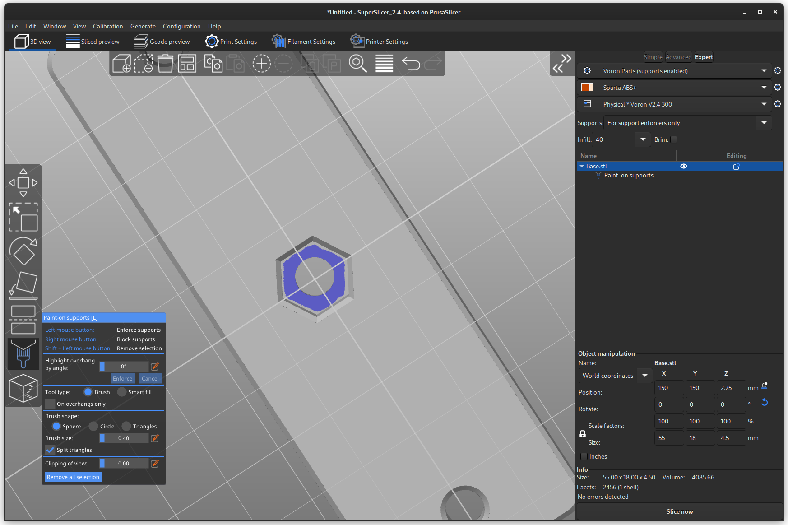
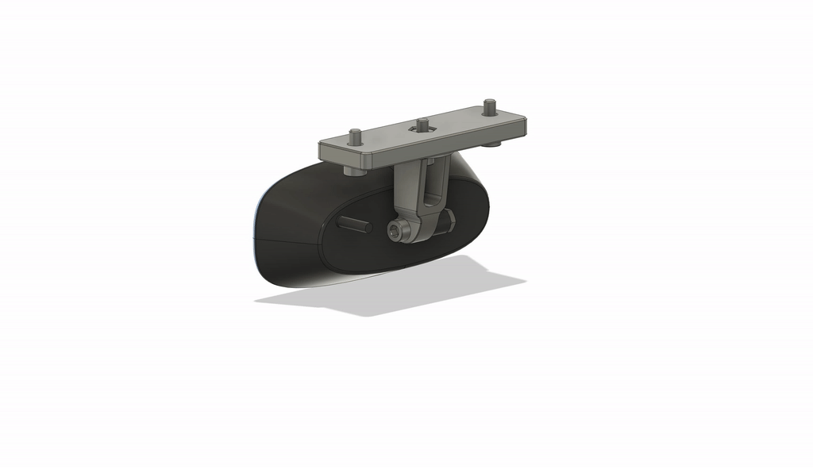

# Adjustable Logitech C270 Camera Mount

The Adjustable Logitech C270 Camera Mount is a mount that can be mounted to any
horizontal 2020 extrusion allowing for the camera angle to be adjusted to best
capture the desired area.

The range of motion should be about 90° for both the horizontal and vertical
planes.

## Printing

The parts should be printed with the default Voron printed parts setting.
In order to provide the best mating surface for the Arm, the base should be
printed with the nut recess facing down. Unfortunately, this means that there is
a need for some minimal supports due to the through hole for the Arm screw.

Below is a suggested supports layout:

## Installation

### BOM

| Part | Count |
|------| :----: |
| Base | 1 |
| Arm  | 1 |
| M3x8 Screw | 3 |
| M3x16 Screw | 1 |
| M3 Nut | 2 |
| M3 T-Nut/Hammer Nut | 2 |

### Assembly

1. Use 1 M3x8 screw and 1 M3 Nut to attach the Arm to the Base. Don't tighten
all the way so the Arm can be rotated later to the desired angle.
2. Use the M3x16 screw and 1 M3 Nut to attach the camera to the Arm. Again,
don't fully tighten so the angle can be adjusted.
3. Mount the camera to the extrusion using 2 M3x8 screws and 2 M3 T-Nuts or
Hammer nuts..
4. Adjust the camera to the desired horizontal and vertical angles and tighten
the Arm M3x8 and M3x16 screws to lock it in place.

