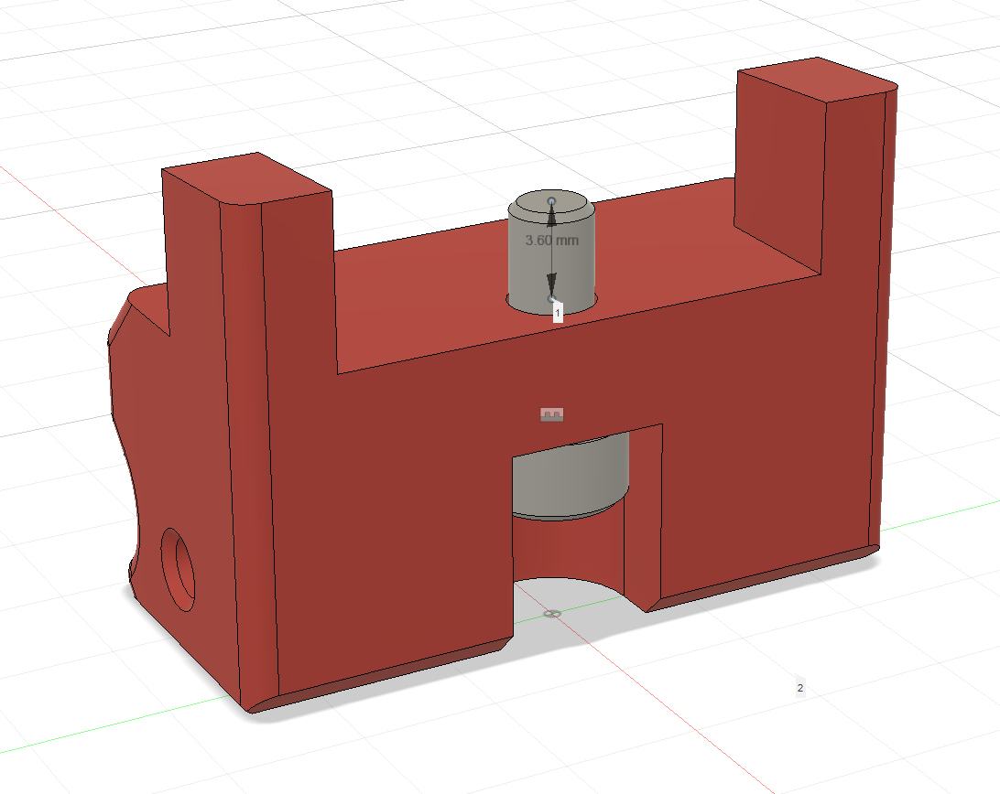
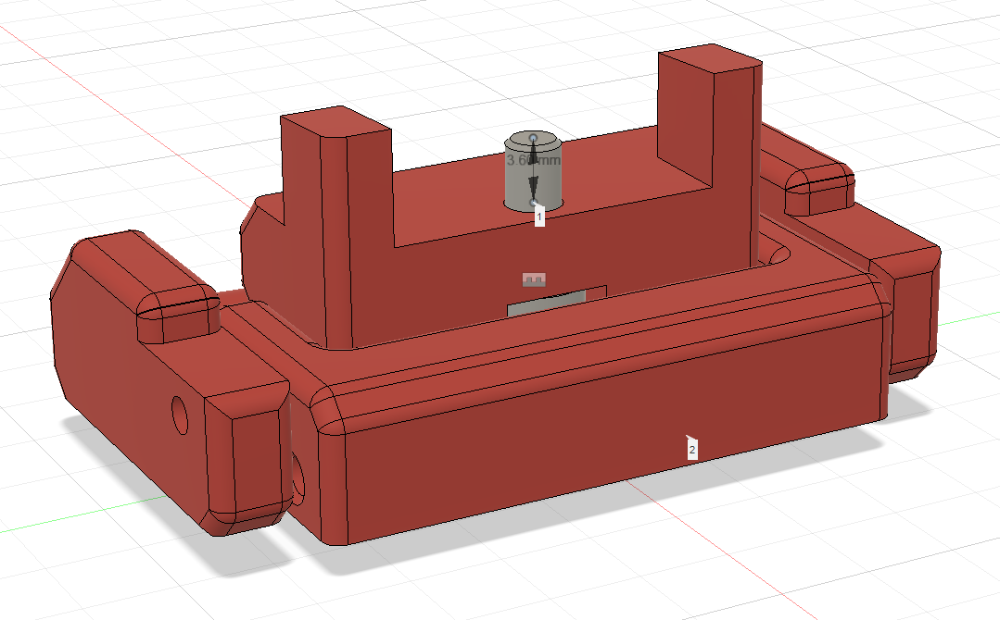

# Quick Release Snap Latches
This snap latch model is based on the great [Printable quick release latch for
panels on 2020 extrusion](https://github.com/VoronDesign/VoronUsers/tree/master/printer_mods/richardjm/snap-latch-2020) mod by
[richardjm](https://github.com/richardjm). The Fusrion360 model that is included
with the mod is highly customizable.

However, I wanted to be able to use the latches with M3x8 screws instead of the
default M3x12. To accomodate that, I modified the Fusion360 model to include an
additional variable (M3ScrewStickOut) that can be used to specify the length of
the screw that is to stick out of the hole.

This allows the user to modify depth of the screw countersink to accommodate
different screws. The default value is 4mm stick out.

