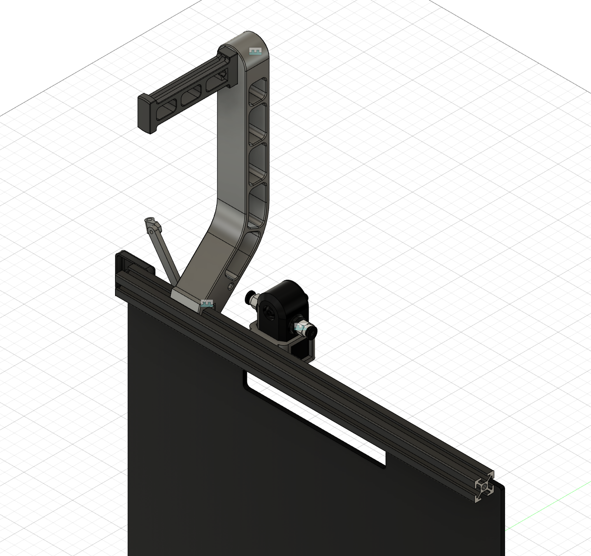
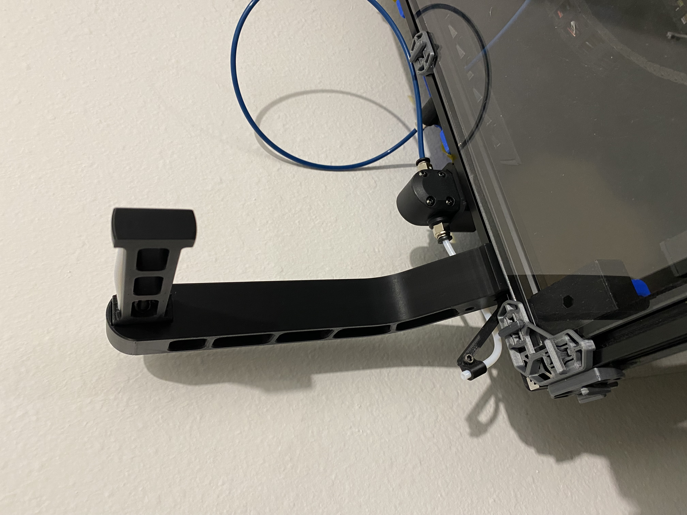
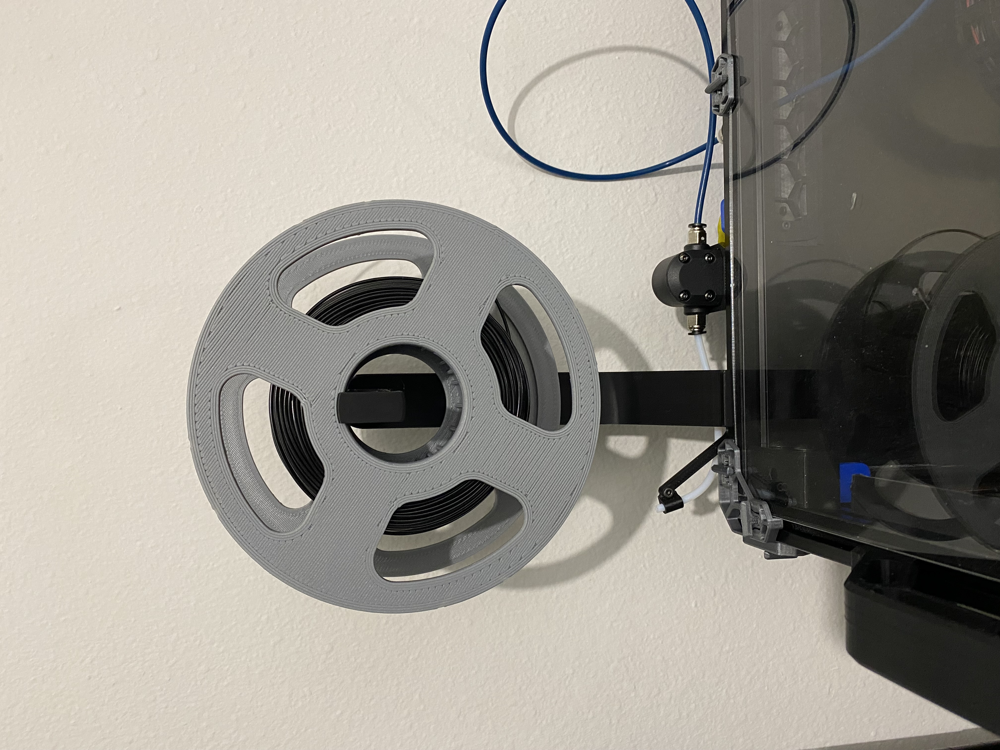
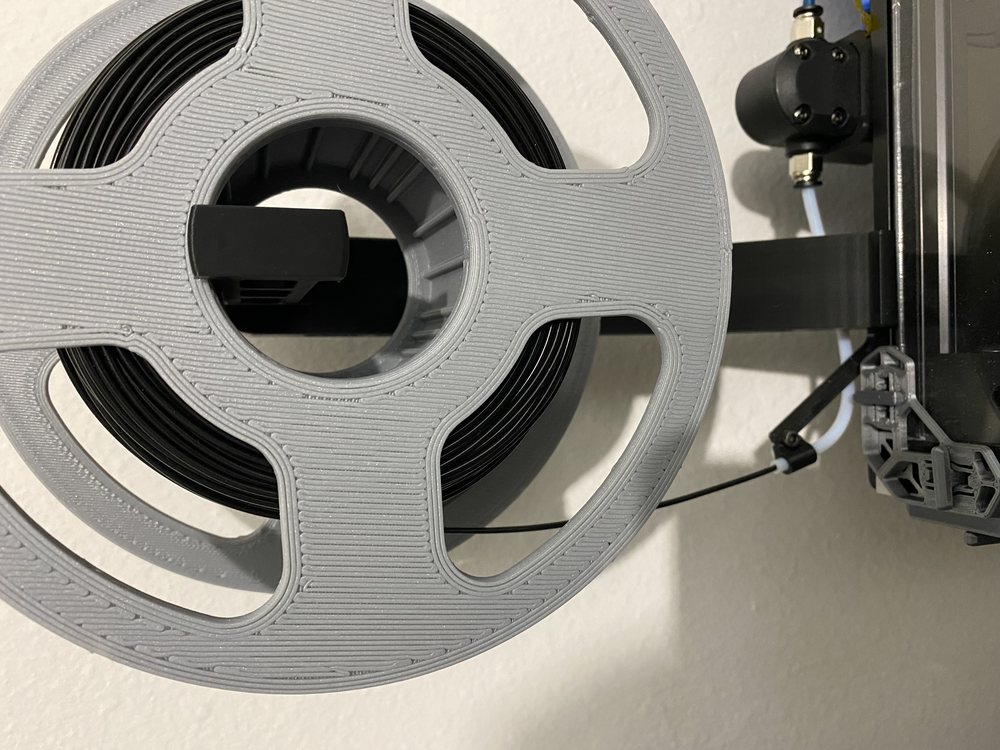
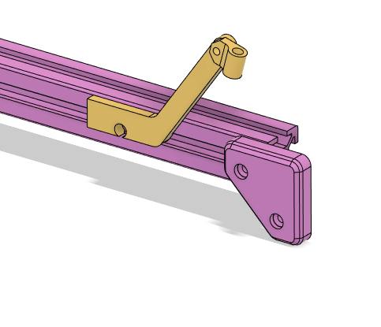
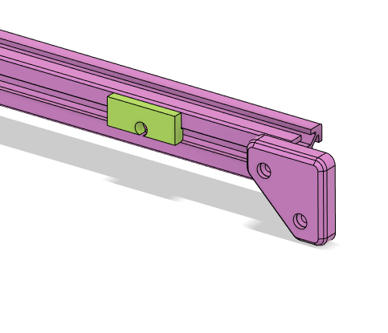
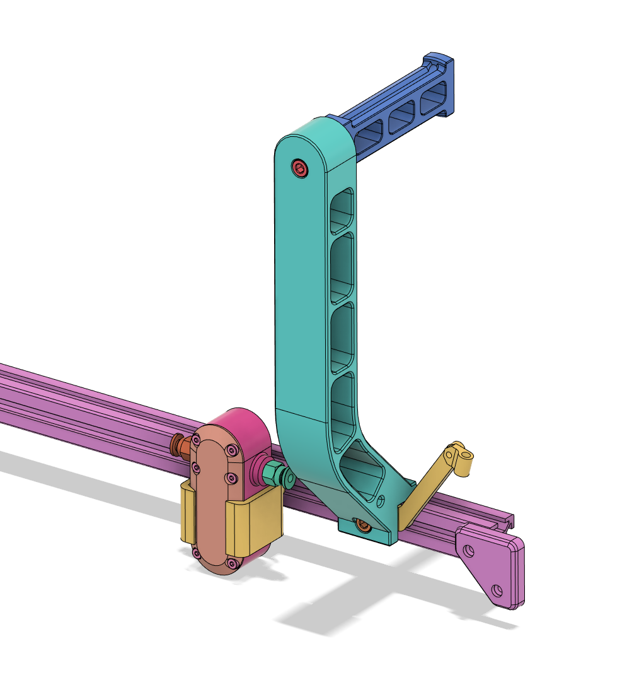

# Voron Top Mount Spool Holder

## About
On my Voron2.4 printer, I have the BTT Smart Filament Sensor mounted in on the
back of the machine. For that reason, I needed a top-mounted spool holder that
is inline with the inlet of the filament sensor. I also wanted to have something
that can serve as a guide for the PTFE tube that goes into the filament sensor
in order to make loading and unloading the filament easier.

<table>
   <tr>
      <td colspan=3></td>
   </tr>
   <tr>
      <td></td>
      <td></td>
      <td></td>
   </tr>
</table>

## Configurations
The primary goal of creating this spool holder was to be able to have better
integration with the BTT Smart Filament Sensor.

However, for people who just want to use the spool holder without the filament
guide arm, there is a spacer that can be used.

 

## BOM

| Item | Count | Description |
| ---  | :--: | -- |
| M5x25 SHCS | 1 | Screw for attaching roller to spool holder |
| M5 Nut | 1 | Nut for securing the roller to the spool holder |
| M5x16 SHCS | 1 | Screw for attaching the spool holder to the frame |
| M5 T-Nut | 1 | Spring T-Nut for attaching the spool holder to the frame |
| PTFE Tube | 1 | A section of PTFE tube for the roller |
| M3x8 SHCS | 2 | (Only if using the BTT filament guide) Screws for attaching the filament guide holder and tube guide to guide arm |
| M3 T-Nut | 1 | (Only if using the BTT filament guide) Sprint T-Nut for attaching the sensor holder to the frame |

## Assembly
### With BTT Smart Filament Sensor

1. Use an M3x8mm SHCS to attach the PTFE Tube guide to the Guide arm.
2. Insert a section of PTFE tube into the one of the channels in the Roller. The
Roller is symmetric so it doesn't matter which one is used.
3. Insert the M5 nut into the nut pocket in the roller.
4. With an M5x25mm SHCS, attach the Roller to the Tower, making sure that the
PTFE tube section in the Roller is facing up.
5. Line up the Guide Arm and the Tower so the screw holes are aligned.
6. Attach the spool holder assembly to the extrusion using an M5x16mm SHCS and
an M5 T-Nut.
7. Attach the filament sensor bracket to the extrusion using an M3x8mm SHCS and
an M3 T-Nut.
8. If the desired position of the spool holder and filament sensor are too close
together, the Tower has a guide hole in it's base that can be used to route the
PTFE through the Tower.

### Without BTT Smart Filament Sensor
For setups without the BTT Smart Filament Sensor, skip steps 1, 7, and 8 from
the list above. Instead of the Guide Arm, use the Spacer when attaching the
spool holder to the frame.